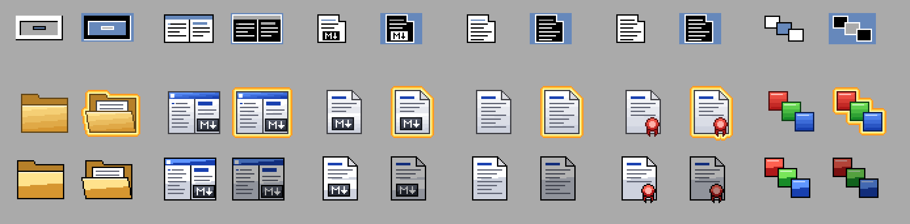

# Amiga-Kickdown

*[English version](README.md)*

Markdown-Werkzeuge für AmigaOS 3.2 in C:

* **Kickdown** – ReAction-basierter Markdown-Editor mit Live-HTML-Vorschau
* **mdtohtml** – Kommandozeilen-Konverter von Markdown nach HTML

Beide nutzen denselben Konvertierungskern (`src/mdconv.c`) auf Basis von
[md4c](https://github.com/mity/md4c), einem schnellen, CommonMark-konformen Parser in C
(als Git-Submodule eingebunden). Sie lösen den ARexx/MUI-Editor und das Free-Pascal-`mdtohtml`
aus [PubAmiga](https://github.com/andregewert/PubAmiga) ab.

## Voraussetzungen

* AmigaOS 3.2 (ReAction-Klassen ab V44, `texteditor.gadget`, `speedbar.gadget`, `bitmap.image`)
* [html.gadget](https://github.com/andregewert/Amiga-HTML-Gadget) in `SYS:Classes/Gadgets/` oder neben Kickdown
  (optional `htmlttf.gadget`)
* [AISS](http://masonicons.info/) für die Toolbar-Bilder (Assign `TBIMAGES:`). Fehlende Bilder
  werden durch Text-Buttons ersetzt.

`mdtohtml` braucht nur die dos.library.

## Kickdown

```
Kickdown [FILE] <name.md> [TEMPLATE <datei>] [CHARSET <name>] [DIALECT GitHub|CommonMark] [TTF] [NOAUTOREFRESH] [NOSYNC] [NOHIGHLIGHT] [LINENUMBERS]
         [FONTSET Vera|DejaVu|Noto] [SIZE n]
```

* Links der Editor (`texteditor.gadget`, Festbreitenschrift), rechts die Vorschau (`html.gadget`),
  dazwischen ein verschiebbarer Balken.
* Die Vorschau folgt eine halbe Sekunde nach der letzten Eingabe (*Preview/Auto refresh*,
  abschaltbar), *Preview/Refresh* (Amiga-R) aktualisiert sofort. Die Scrollposition bleibt erhalten.
* Syntax-Hervorhebung im Editor (*Edit/Syntax highlighting*, braucht texteditor.gadget V47):
  Überschriften, Hervorhebungen, Code (auch Codeblöcke), Zitate, Listenzeichen, Links, URLs,
  Tabellen, HTML-Tags und Entities.
* Zeilennummern im Editor einblendbar (*Edit/Line numbers*).
* Einstellungsfenster (*Project/Settings...*) mit den Kategorien Editor, Preview (Renderer,
  TrueType-Schriften, Aktualisierung, Scrollen), Markdown (Dialekt, Zeichensatz, Template),
  Colours (Farben der Syntax-Hervorhebung), Window (Startgröße und -position, „Current“ übernimmt
  sie vom offenen Fenster) und Toolbar (Bilder, Bilder und Text oder nur Text, Rahmen um die
  Knöpfe; ab dem nächsten Start, nur Text startet schneller, weil keine Bilder geladen werden, mit
  Texten erhalten die Formatierungsknöpfe eine zweite Zeile; die Formatierungsknöpfe lassen sich
  ausblenden, auch sofort mit *Format/Show formatting buttons*). *Save* schreibt sie in die Tooltypes des
  Kickdown-Icons, *Use* gilt für die laufende Sitzung; andere Tooltypes bleiben unverändert.
* Editor und Vorschau scrollen gemeinsam (*Preview/Synchronize scrolling*, in beide Richtungen).
  Überschriften sind die Fixpunkte, dazwischen wird interpoliert.
* Relative Bildpfade beziehen sich auf die Schublade des Dokuments.
* Links: `#anker` scrollen die Vorschau, Links auf `.md`-Dateien öffnen diese im Editor, andere
  Links erscheinen in der Statuszeile.
* Überschriften erhalten Anker wie auf GitHub (`## Zwei Worte` → `#zwei-worte`), damit
  Inhaltsverzeichnisse funktionieren.
* Öffnen, Speichern, Speichern als, HTML exportieren; Rückfrage vor dem Verwerfen von Änderungen
  und vor dem Überschreiben.
* Ausschneiden/Kopieren/Einfügen/Rückgängig/Wiederholen, alles markieren; Markierungen in der
  Vorschau lassen sich ebenfalls kopieren.
* Suchen und Ersetzen (*Edit/Find...*, Amiga-F): ein Fenster neben dem Editor mit Groß-/Klein-
  schreibung, ganzen Wörtern, rückwärts und Umlauf; „Replace all“ ist ein Rückgängig-Schritt.
  *Find next* (Amiga-G) wiederholt die letzte Suche.
* Formatierung (Toolbar und Menü *Format*): Überschrift (jeder Klick eine Ebene mehr, bis
  `###`), fett, kursiv, unterstrichen (`<u>`, Markdown kennt das nicht), Code (mehrere Zeilen werden ein Codeblock), Link, Bild, Aufzählung,
  nummerierte Liste, Aufgabenliste, Zitat. Inline-Formate umschließen die Markierung oder werden
  entfernt, wenn sie schon vorhanden sind; fett, kursiv und unterstrichen über mehrere Zeilen formatieren jede
  Zeile einzeln hinter ihrem Listen-, Zitat- oder Überschriftenzeichen; Listenformate gelten für
  alle markierten Zeilen. Jeder
  Befehl ist ein Rückgängig-Schritt.
* Knöpfe, die in ein schmales Fenster nicht hineinpassen, stehen in der Liste hinter dem Pfeil
  am rechten Ende der Toolbar.
* Toolbar-Knöpfe werden ausgegraut, wenn sie nichts bewirken würden (Speichern,
  Rückgängig/Wiederholen, Ausschneiden/Kopieren); Hilfe-Bubbles an den Knöpfen.
* Startfenster mit Icon, Version und Fortschrittsbalken, solange das Programm startet (abschaltbar
  auf der Seite Window der Einstellungen).
* Statuszeile mit Cursorposition, das Mausrad scrollt den Bereich unter dem Mauszeiger.
* AppWindow: ein auf das Fenster gezogenes Icon wird geöffnet.
* Ikonifizieren (Gadget in der Titelleiste oder *Project/Iconify*): Das Kickdown-Icon erscheint auf
  der Workbench, ein Doppelklick oder ein darauf gezogenes Markdown-Icon öffnet das Fenster wieder.

Die Einstellungen kommen aus den Tooltypes des Kickdown-Icons, auch beim Start aus der Shell;
Shell-Argumente und Tooltypes eines Projekt-Icons gehen vor. Dieselben Optionen werden gelesen (`TEMPLATE=`, `CHARSET=`,
`DIALECT=`, `TTF`, `NOAUTOREFRESH`, `NOSYNC`, `NOHIGHLIGHT`, `LINENUMBERS`,
`FONTSET=`, `SIZE=`, `WIDTH=`, `HEIGHT=`, `LEFT=`, `TOP=`, `TOOLBAR=IMAGES|BOTH|TEXT`, `TOOLBARFRAMES`, `NOFORMATBUTTONS`, `NOSPLASH`,
`COLOR_HEADING=RRGGBB` … `COLOR_HTML=`).

## mdtohtml

```
mdtohtml [FROM|FILE] <datei.md> [TO|OUTFILE <datei.html>] [TEMPLATE <datei>]
         [CHARSET|ENCODING <name>] [TITLE <text>] [DIALECT|MODE GitHub|CommonMark]
```

* Ohne `FROM` wird von der Standardeingabe gelesen, ohne `TO` auf die Standardausgabe geschrieben.
* `DIALECT`: `GitHub` (Standard; Tabellen, Durchstreichen, Aufgabenlisten, Autolinks, Fußnoten)
  oder `CommonMark`.
* `CHARSET` landet nur im `<meta>`-Tag, der Text wird nicht umkodiert. Standard: `UTF-8`, wenn
  die Eingabe gültiges UTF-8 mit Nicht-ASCII-Zeichen ist, sonst `ISO-8859-1`.
* `TITLE`: Standard ist die erste `#`-Überschrift, sonst der Dateiname.
* Aufgabenpunkte erhalten `type="none"`: kein Aufzählungszeichen, das Kästchen steht an seiner
  Stelle (Browser und html.gadget 1.1).

Hinweis: Die Pascal-Version hatte Unix-Optionen (`-f`, `-o`, `-t` …). Diese Version benutzt die
übliche AmigaDOS-Schablone; `FILE`, `OUTFILE`, `ENCODING` und `MODE` bleiben als Aliase erhalten.

### Templates

HTML-Datei mit den Platzhaltern `$title$`, `$encoding$` (oder `$charset$`) und `$body$`, siehe
`test/template.html`. Kickdown verwendet das Template für Vorschau und Export.

## Sprachen

Kickdown ist über die locale.library übersetzbar: Englisch ist eingebaut, Deutsch kommt als Katalog
(`Catalogs/deutsch/Kickdown.catalog`). Kickdown findet Kataloge neben dem Programm
(`PROGDIR:Catalogs`) oder in `LOCALE:Catalogs`; das Installer-Skript kopiert die ausgewählten.

`catalogs/Kickdown.cd` enthält alle Texte, `catalogs/<sprache>.ct` die Übersetzungen, beide im
Format von CatComp und FlexCat. `tools/catcomp.py` (Teil von `make`) erzeugt daraus
`src/strings.h` und die Kataloge und lehnt Übersetzungen ab, deren Platzhalter (`%s`, `%lu` …)
vom Original abweichen. Für eine neue Sprache `catalogs/<sprache>.ct` anlegen (z. B. als Kopie
von `deutsch.ct`) und im `package/Install` eine Auswahl ergänzen.

## Icons

Das Archiv hat klassische Icons; vollständige Sätze im **GlowIcons**- und **NewIcons**-Stil
liegen in `Icons/` (Doppelklick auf `UseGlowIcons`, `UseNewIcons` oder `UseClassic`).
`tools/icons.py` zeichnet sie mit dem Icon-Werkzeug von html.gadget
(`html_gadget/tools/mkicons.py`).



## Bauen

Benötigt [bebbos amiga-gcc](https://codeberg.org/bebbo/amiga-gcc) unter `/opt/amiga` (mit NDK 3.2)
und Python 3 für die Kataloge.

```
git submodule update --init
make                # bin/Kickdown, bin/mdtohtml
make check          # Konverter-, Scroll-Sync- und Highlighting-Tests auf dem Host (ASan)
make check-update   # gewollte Ausgabeänderungen als neue Referenz übernehmen
make dist           # Aminet-Archiv dist/Kickdown.lha (+ Kickdown.readme)
make icons          # Beispiel-Icons aller Stile in icons/, Vorschau in icons/preview.png
```

Alle Amiga-Quellen und Testdateien sind **ISO-8859-1** kodiert; `make` bricht bei UTF-8 ab.
md4c und die Header von html.gadget sind Git-Submodules (`md4c/`, `html_gadget/`), beide auf ein
Release-Tag gepinnt.

## Lizenz

MIT, siehe [LICENSE](LICENSE). md4c steht ebenfalls unter MIT (`md4c/LICENSE.md`).
