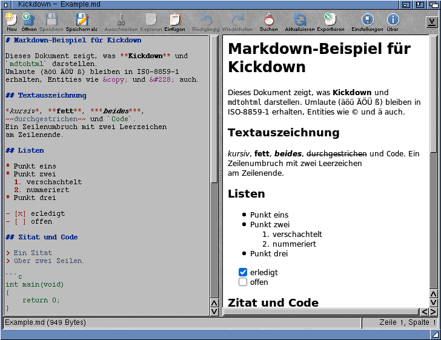

# Amiga-Kickdown

*[Deutsche Version](README.de.md)*

Markdown tools for AmigaOS 3.2, written in C:

* **Kickdown** – a ReAction based Markdown editor with live HTML preview
* **mdtohtml** – a command line converter from Markdown to HTML

Both share the same converter core (`src/mdconv.c`) built on
[md4c](https://github.com/mity/md4c), a fast CommonMark compliant parser written in C
(included as git submodule). They replace the earlier ARexx/MUI editor and the
Free Pascal based `mdtohtml` from [PubAmiga](https://github.com/andregewert/PubAmiga).



*Kickdown on AmigaOS 3.2 (German catalog): editor with syntax highlighting, live preview*

## Requirements

* AmigaOS 3.2 (ReAction classes V44+, `texteditor.gadget`, `speedbar.gadget`, `bitmap.image`)
* [html.gadget](https://github.com/andregewert/Amiga-HTML-Gadget) in `SYS:Classes/Gadgets/` or next to Kickdown
  (optionally `htmlttf.gadget`)
* [AISS](http://masonicons.info/) for the toolbar images (`TBIMAGES:` assign). Missing images are
  replaced by text buttons.

`mdtohtml` only needs dos.library and runs on any AmigaOS.

## Kickdown

```
Kickdown [FILE] <name.md> [TEMPLATE <file>] [CHARSET <name>] [DIALECT GitHub|CommonMark] [TTF] [NOAUTOREFRESH] [NOSYNC] [NOHIGHLIGHT] [LINENUMBERS]
         [FONTSET Vera|DejaVu|Noto] [SIZE n]
```

* Editor (`texteditor.gadget`, fixed width font) on the left, HTML preview (`html.gadget`) on the
  right, the weight bar between them adjusts the split.
* The preview follows the text half a second after you stop typing (*Preview/Auto refresh*,
  can be switched off), *Preview/Refresh* (Amiga-R) updates it at once. The scroll position is kept.
* Syntax highlighting in the editor (*Edit/Syntax highlighting*, needs texteditor.gadget V47):
  headings, emphasis, code spans and fenced code blocks, quotes, list markers, links, URLs,
  tables, HTML tags and entities.
* Line numbers can be shown in the editor (*Edit/Line numbers*).
* Settings window (*Project/Settings...*): categories Editor, Preview (renderer, TrueType fonts,
  refresh, scrolling), Markdown (dialect, charset, page template), Colours (syntax
  highlighting), Window (start size and position, "Current" takes them from the open window) and
  Toolbar (images, images and text or text only, frames around the buttons; from the next start,
  text only starts faster as no images are loaded, with texts the formatting buttons get a second
  row; the formatting buttons can be hidden, also at once with *Format/Show formatting buttons*). *Save* writes them into the tool types of the Kickdown icon, *Use* keeps them for
  this session; other tool types of the icon are left alone.
* Editor and preview scroll together (*Preview/Synchronize scrolling*, both directions). Headings
  are the fixed points, positions between them are interpolated.
* Relative image paths are resolved against the document's drawer.
* Links: `#anchors` scroll the preview, links to `.md` files open them in the editor, other
  links are shown in the status line.
* Headings get GitHub style anchors (`## Two Words` → `#two-words`), so tables of contents work.
* Open, Save, Save as, Export HTML; asks before discarding changes or replacing files.
* Cut/Copy/Paste/Undo/Redo, select all; text selected in the preview can be copied, too.
* Find and replace (*Edit/Find...*, Amiga-F): a window next to the editor with case sensitive,
  whole words, backwards and wrap around; Replace all is one undo step. *Find next* (Amiga-G)
  repeats the last search.
* Formatting (toolbar and *Format* menu): heading (every click one level more, up to `###`),
  bold, italic, underline (`<u>`, Markdown has none), code (several lines become a code block), link, image, bulleted, numbered and
  task list, quote. Inline formats wrap the selection or are removed if it already has them;
  bold, italic and underline over several lines format each line after its list, quote or heading marker;
  list formats work on all selected lines. Each command is one undo step.
* Buttons that do not fit into a narrow window are listed under the arrow at the right end of
  the toolbar.
* Toolbar buttons are ghosted when they would do nothing (Save, Undo/Redo, Cut/Copy); help
  bubbles on the buttons.
* A splash window with icon, version and progress bar while the program starts (can be switched
  off on the Window page of the settings).
* Status line with the cursor position, mouse wheel scrolls the pane under the pointer.
* AppWindow: drop a Markdown icon on the window to open it.
* Iconify (gadget in the title bar or *Project/Iconify*): the Kickdown icon appears on the
  Workbench, a double click or a Markdown icon dropped on it opens the window again.

The settings are read from the tool types of the Kickdown icon, also when Kickdown is started from
the Shell; Shell arguments and the tool types of a project icon take precedence. The same options (`TEMPLATE=`, `CHARSET=`,
`DIALECT=`, `TTF`, `NOAUTOREFRESH`, `NOSYNC`, `NOHIGHLIGHT`, `LINENUMBERS`,
`FONTSET=`, `SIZE=`, `WIDTH=`, `HEIGHT=`, `LEFT=`, `TOP=`, `TOOLBAR=IMAGES|BOTH|TEXT`, `TOOLBARFRAMES`, `NOFORMATBUTTONS`, `NOSPLASH`,
`COLOR_HEADING=RRGGBB` … `COLOR_HTML=`); a relative `TEMPLATE` is relative to the icon's drawer.
Set Kickdown as default tool of your `.md` icons to open them by double click.

## mdtohtml

```
mdtohtml [FROM|FILE] <file.md> [TO|OUTFILE <file.html>] [TEMPLATE <file>]
         [CHARSET|ENCODING <name>] [TITLE <text>] [DIALECT|MODE GitHub|CommonMark]
```

* Without `FROM` the Markdown text is read from standard input, without `TO` the page is
  written to standard output (e.g. `mdtohtml <readme.md >readme.html`).
* `DIALECT`: `GitHub` (default; tables, ~~strikethrough~~, task lists, autolinks, footnotes) or
  `CommonMark`.
* `CHARSET` is only written into the page, the text itself is not converted. Default: `UTF-8` if
  the input is valid UTF-8 with non-ASCII characters, otherwise `ISO-8859-1`.
* `TITLE`: default is the first `#` heading, otherwise the file name.
* Raw HTML in the Markdown text is passed through.
* Task list items get `type="none"`: no list marker, the checkbox takes its place (browsers and
  html.gadget 1.1).

Note: the Free Pascal version used Unix style options (`-f`, `-o`, `-t` ...). This version uses
the usual AmigaDOS template; `FILE`, `OUTFILE`, `ENCODING` and `MODE` are kept as aliases.

### Templates

A template is an HTML file with the placeholders `$title$`, `$encoding$` (or `$charset$`) and
`$body$` (case is ignored), see `test/template.html`. Without a template a minimal HTML 4 frame
is used. Kickdown uses the template for the preview and the export.

## Languages

Kickdown is localized through locale.library: English is built in, German comes as catalog
(`Catalogs/deutsch/Kickdown.catalog`). Kickdown finds catalogs next to the program
(`PROGDIR:Catalogs`) or in `LOCALE:Catalogs`; the Installer script copies the ones you select.

`catalogs/Kickdown.cd` lists all strings, `catalogs/<language>.ct` are the translations, both in
the format of CatComp and FlexCat. `tools/catcomp.py` (part of `make`) makes `src/strings.h` and
the catalogs and refuses translations whose format specifiers (`%s`, `%lu` …) differ from the
original. For a new language add `catalogs/<language>.ct` (e.g. copied from `deutsch.ct`) and a
choice in `package/Install`.

## Icons

The archive comes with classic icons; complete sets in the **GlowIcons** and **NewIcons**
style are in `Icons/` (double click `UseGlowIcons`, `UseNewIcons` or `UseClassic`).
`tools/icons.py` draws them with the icon writer of html.gadget (`html_gadget/tools/mkicons.py`).


## Building

Requires [bebbo's amiga-gcc](https://codeberg.org/bebbo/amiga-gcc) in `/opt/amiga` (with NDK 3.2)
and Python 3 for the catalogs.

```
git clone --recursive <repository>     # or: git submodule update --init
make                # bin/Kickdown, bin/mdtohtml
make check          # converter, scroll sync and highlighting tests on the host (AddressSanitizer)
make check-update   # accept intended output changes as new reference
make dist           # Aminet archive dist/Kickdown.lha (+ Kickdown.readme)
make icons          # sample icons of all styles in icons/, preview in icons/preview.png
```

All Amiga sources and test files are **ISO-8859-1** encoded; `make` refuses UTF-8 (`make charcheck`).
md4c and the html.gadget headers come as git submodules (`md4c/`, `html_gadget/`), both pinned
to a release tag.

## License

MIT, see [LICENSE](LICENSE). md4c is MIT licensed as well (`md4c/LICENSE.md`).
